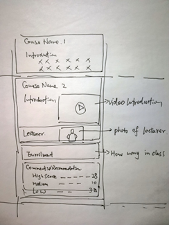

# E-Learning

---

## 提交

- 项目

- 运行时截图

- 文档

---

## Assignment 1

实现UI布局设计与导航

要求：

- 查看提供课程的列表
- 查看课程详细信息，包括：课程介绍，大纲，课程日历（这个是每周多久上课的课表or每次上课的内容提要）与课程注册
- 平台登录与注册
- 浏览和搜索学习材料，包含多媒体

---

## Assignment 2

实现 Assignment 1中的功能

实现 Assignment 1要求：

- 查看提供课程的列表

- 查看课程详细信息，包括：课程介绍，大纲，课程日历（这个是每周多久上课的课表or每次上课的时间和内容安排？）等与课程注册

- 平台登录与注册

- 浏览和搜索学习材料，包含多媒体

新增：

- 登录与注册要求检验输入合法性
- 使用 recyclerview 展示数据集，包括：课程列表与搜索结果等
- 数据集（例如：课程信息，课程材料（这个指课件）等等）需要从web服务器获取，因此使用api是必要的（例如retrofix, picasso）
- 对于多媒体，例如音频/视频课程，要求实现lesson broadcasting（就是能放音视频？）

---

## Assignment 3

实现更好的用户体验，鼓励使用多种安卓编程技术（~~科技~~），例如： local data caching, layout transition 以及优化界面设计

要求：

- recyclerview 展示课程列表，并添加更多信息和布局（下图是他给的例子：在一个recyclerview 中添加不同的viewitem；添加视频，统计图表等东西；任何吸引眼球的东西）

- 给导航添加过渡动画
- 用户登录后，下次打开app会记住登录并**回到用户最后一次使用的界面**，可以使用the shared preferences api 储存用户行为和运行时状态
- 缓存用户的浏览数据在本地的SQLlite或者文件缓存，这样同一个数据的请求就只会进行一次
- 对于需要长时间的任务，例如加载和上次图像或视频（such as loading/uploading image or video，为啥会有上传？？？？），储存缓存文件等，使用multi thread或者多线程

- 使用broadcast receiver，当服务器有更新的时候通知用户

---

## Assignment 4

实现MVVM和architecture components

要求：

- 重写程序，使得至少一个module使用mvvm，并且使用room api进行数据访问，鼓励用kotlin
-  Add in Introduction slide page to your app.（？？？？）
- 实现第三方登录，使用qq或者微信账号
- 能够分析课程通知（course announcements）到微信/短信

---

## Assignment 5

单元测试与安卓测试框架

要求提供完整的单元测试用例并且为至少一个activity module实现安卓测试