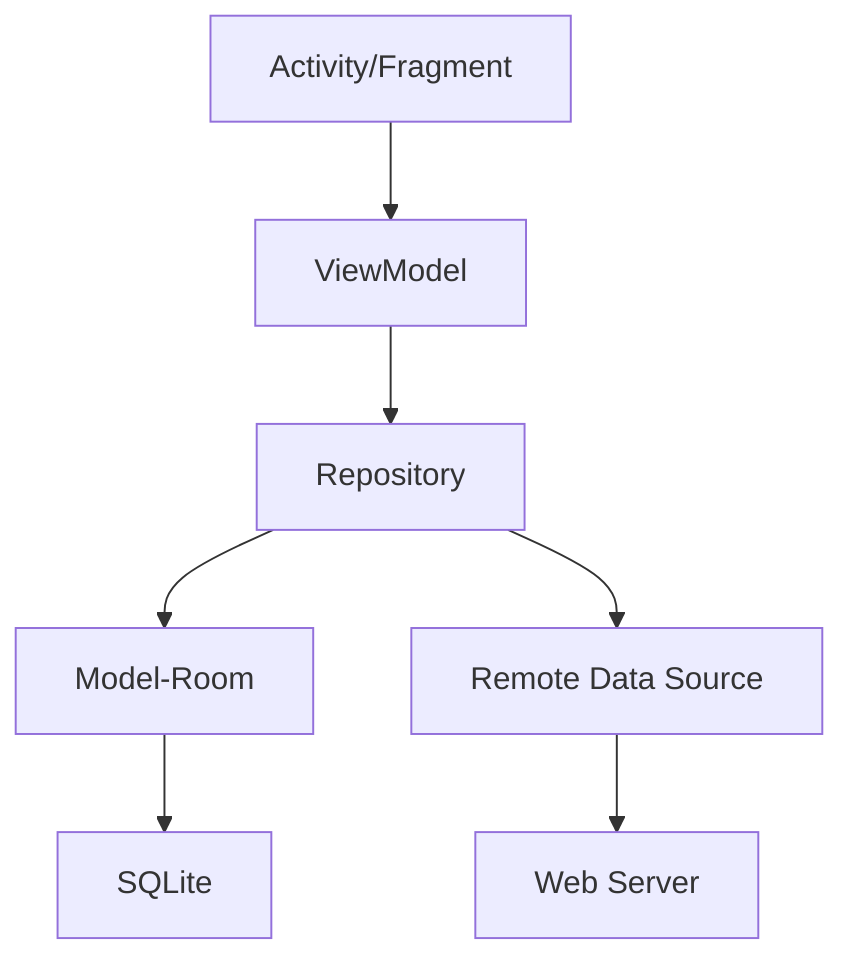
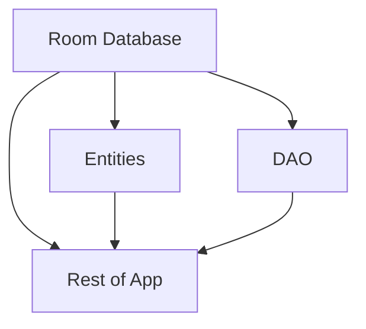

[toc]

Emoji :zero: means I have do nothing yet, :keycap_ten: means I have finished it.

# Introduction

E-learning is a platform that provides courses to students. In our app, students can explore courses, study and communicate.

# Brief Design

The app can be divided into these main functions:

- Explore All Courses

- Explore Registered Courses

- Calendar

- Communicate

# Architecture

# Activity/Fragment :two:

In my architecture, there is only one main activity. All other views are switched in the activity.
	
Thanks to Google’s new navigation method, I just add all navigation destinations and actions in the `nav_graph.xml`, instead of using `FragmentManager`.
	
Main navigation method is use navigation drawer.

## Home :three:

### Channel :zero:

In order to help student choose specific type of courses, we can divide all courses into different categories.

### Recommend :six:

Show recommend courses to students.

### Timeline​ :zero:

Show your courses’ news or so on.

## Course :one:

Show courses’ information, register and study.

## My Courses :zero:

Show courses you registered only.

## Calendar :zero:

Show your courses’ date.

## Authentication :four:

### Profile :zero:

Show user’s profile and edit.

If not authenticated, navigate to login.

### Login :eight:

Login to account.

If press back, navigate to home.

### Register​ :five:

#### Profile Data :eight:

input user’s name.

#### User Password :eight:

input user’s account and password.

## Setting :three:

### log out :six:

### change language :six:

## Message :zero:

Under planning..., may be abandoned.

# ViewModel :four:

> The [`ViewModel`](https://developer.android.com/reference/androidx/lifecycle/ViewModel.html) class is designed to store and manage UI-related data in a lifecycle conscious way. The [`ViewModel`](https://developer.android.com/reference/androidx/lifecycle/ViewModel.html) class allows data to survive configuration changes such as screen rotations. 

ViewModel can store some `LiveData`, so activities and fragments can observe the data change and do UI or other operations, just like the Observe Pattern.

## `CourseViewModel` :three:

handle CRUD of courses.

## `UserViewModel` :three:

handle CRUD if user.

## `RegistrationViewModel` :five:

handle Registration of user.

## `LoginViewModel` :five:

handle Login of user.

# Repository :four:

To decoupled ViewModel from database and network, the repository controls them.  It decreases the maintain work if I add net server support later.
	
## Model-Room :eight:

> Room provides an abstraction layer over SQLite to allow fluent database access while harnessing the full power of SQLite. 

Just like mybatis with Spring, Room help me reduce code to CRUD.
	
## Remote Data Source :zero:

I will develop it in Spring.

