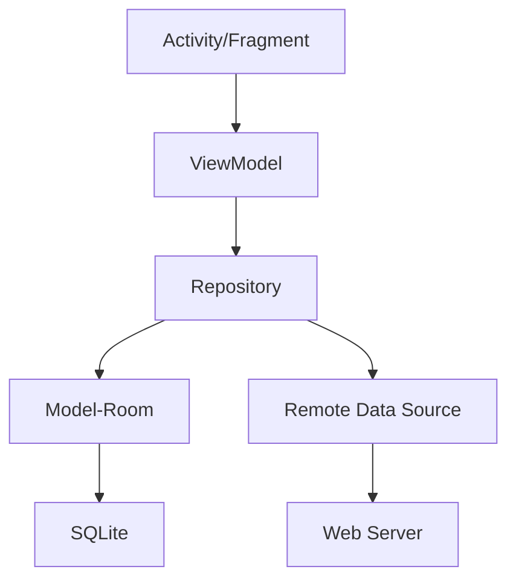
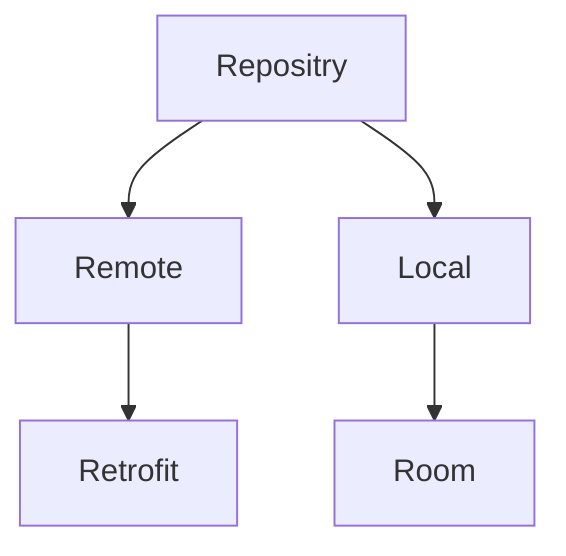
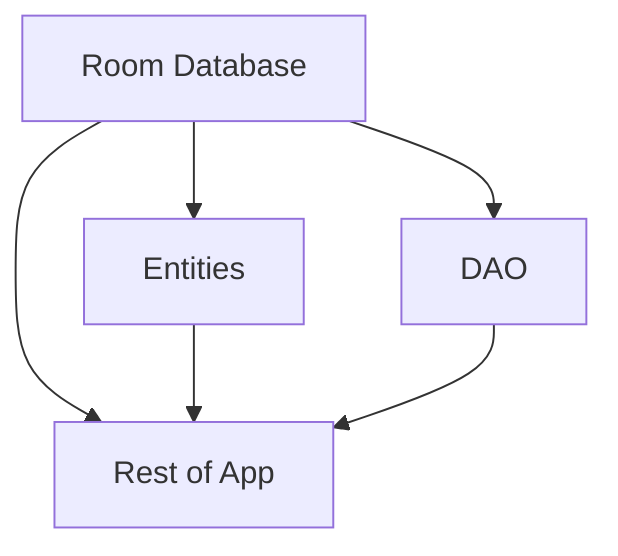

[TOC]

# Introduction

E-learning is a platform that provides courses to students. In our app, students can explore courses, study and communicate.

Please refer to **[readme.pdf](./readme.pdf)** for mermaid is not supported by Github.

[Screenshot](./assets)

# Technology

Jet Pack: Data Binding, Navigation, View Model, Room

JUnit

# Brief Design

The app can be divided into these main functions:

- Explore All Courses

- Explore Registered Courses

- Calendar

- Communicate

# Architecture

# Activity/Fragment

In my architecture, there is only one main activity. All other views are switched in the activity.
	
Thanks to Google’s new navigation method, I just add all navigation destinations and actions in the `nav_graph.xml`, instead of using `FragmentManager`.
	
Main navigation method is use navigation drawer.

## Home

### Category

In order to help student choose specific type of courses, we can divide all courses into different categories.

### Recommend

Show recommend courses to students.

## Course

Show courses’ information, register and study.

## My Courses

Show courses you registered only.

## Calendar

Show your courses’ date.

## Authentication

### Profile

Show user’s profile and edit.

If not authenticated, navigate to login.

### Login

Login to account.

If press back, navigate to home.

### Register

#### User Password

input user’s account and password.

## Setting

### change language

# ViewModel

> The [`ViewModel`][ViewModel] class is designed to store and manage UI-related data in a lifecycle conscious way. The [`ViewModel`][ViewModel] class allows data to survive configuration changes such as screen rotations. 

ViewModel can store some `LiveData`, so activities and fragments can observe the data change and do UI or other operations, just like the Observe Pattern.

## `CourseViewModel`

handle CRUD of courses.

## `UserViewModel`

handle CRUD if user.

## `RegistrationViewModel`

handle Registration of user.

## `LoginViewModel`

handle Login of user.

## `CalendarViewModel`

handle lessons of current month.

# Repository

## Model-Room

> Room provides an abstraction layer over SQLite to allow fluent database access while harnessing the full power of SQLite. 

Just like mybatis with Spring, Room help me reduce code to CRUD.
	

## Remote Data Source

Retrofit

[ViewModel]: https://developer.android.com/reference/androidx/lifecycle/ViewModel.html

